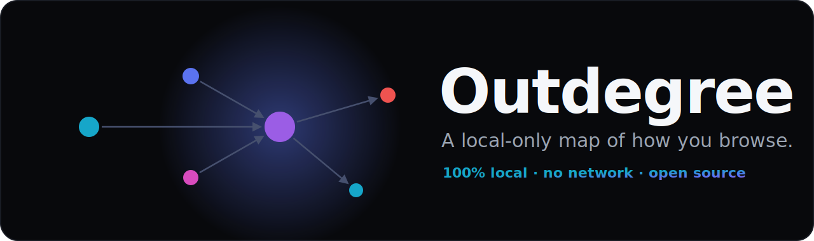
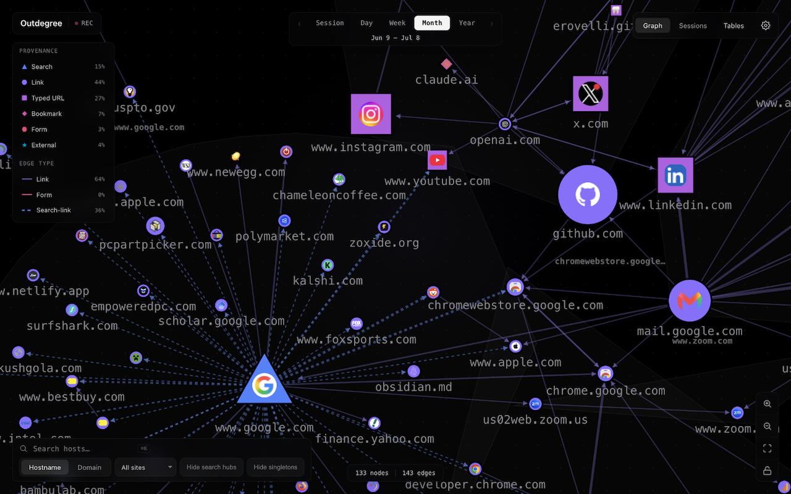
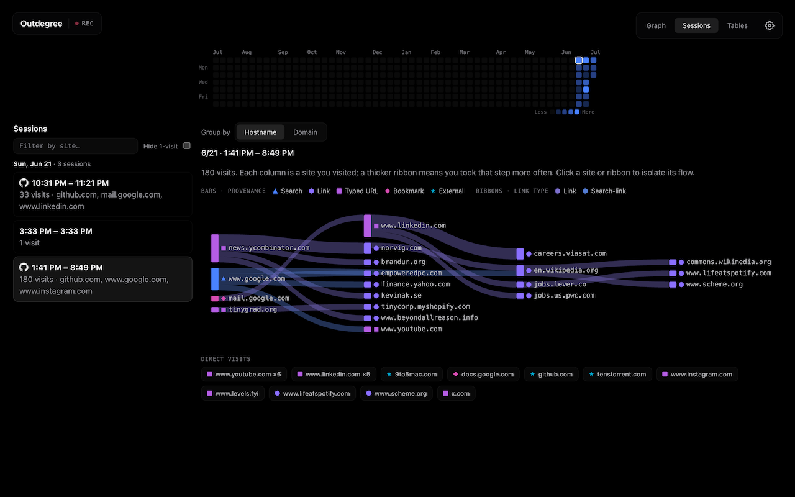
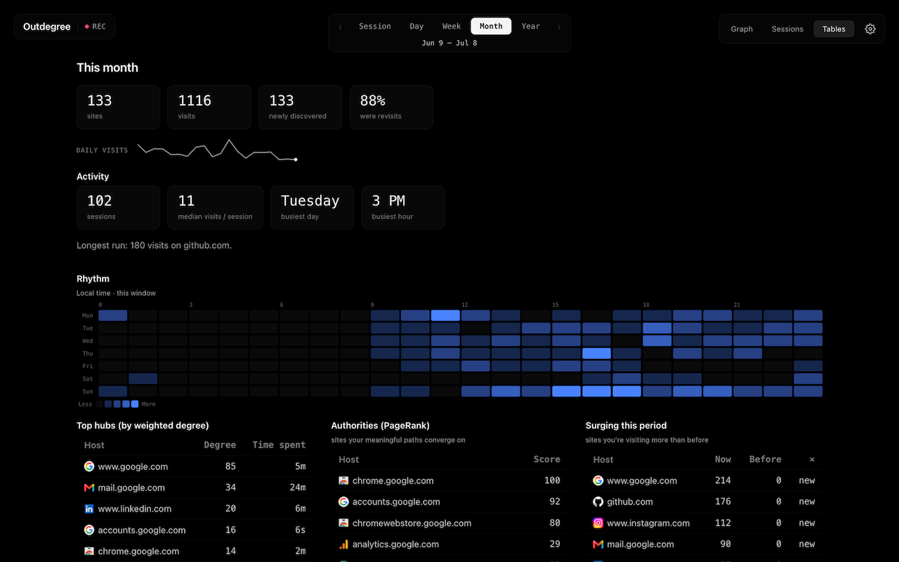

<p align="center">
  
</p>

<p align="center">
  <a href="https://chromewebstore.google.com/detail/outdegree/kjmjfehjgbcgibkbekgacfgibfmglmod"></a>
  <a href="https://github.com/erovelli/Outdegree/actions/workflows/ci.yml"></a>
  <a href="LICENSE"></a>
  
  
  
</p>

<p align="center"><strong>100% local · no network · open source.</strong></p>

A Chrome MV3 extension that records your web navigations as a directed graph you
can explore over time (session → day → week → month → year). The capture layer is
a tiny append-only TypeScript service worker; all the interesting work —
deriving origins, collapsing redirects, rolling up days, detecting communities,
laying out the graph — runs as a **Rust → WebAssembly** core on the dashboard
page.

<p align="center">
  
</p>

---

## Why it's private by construction

The privacy story is **browser-enforced**, not just promised:

| Guarantee | Enforced by |
|---|---|
| No network egress | `host_permissions: []` **and** CSP `connect-src 'none'` — `fetch`/`XHR`/`WebSocket`/`sendBeacon` are blocked by the browser |
| Never records incognito | `"incognito": "not_allowed"` in the manifest |
| No remote code | no content scripts, no `<all_urls>`, `psl` embeds the Public Suffix List at compile time, UI runs in CSR (no hydration callback) |
| Only data-out path | a **user-initiated local file download** (export) — a `Blob` to disk, never an upload |

See [`docs/privacy-policy.md`](docs/privacy-policy.md).

---

## Architecture

```
Service Worker (TypeScript, append-only)        Dashboard page (Rust → WASM)
  onCommitted               → "nav"   ┐            derive   global-order read-time pass
  onCreatedNavigationTarget → "link"  │ ONE id     rollup   UTC-day buckets + sessions
  tabs.onRemoved            → "close" │ sequence   project  range merge + display filters
  onStartup                 → "start" ┘ (events)   graph    Louvain · hubs · PrefixSpan
  onHistoryStateUpdated     → "nav"   ┐ (spa        layout   Fruchterman–Reingold
  onReferenceFragmentUpdated→ "nav"   ┘  store)     render   canvas2d · svg · flow · ui · store(rexie)
```

Key commitments:

- **WASM never runs in the service worker** (MV3 sync listeners vs async WASM).
  All Rust lives on the dashboard page.
- **The service worker is append-only** — no derived or per-tab state. Everything
  is reconstructed at read time, in **strict global id order**, over one unified
  `events` store.
- The read-time pass carries a **complete `DeriveState` checkpoint**, so an
  incremental fold over `id > watermark` is **bit-identical** to a from-scratch
  recompute (verified at every watermark split — see the tests).

The pure core (`interpret` / `derive` / `rollup` / `project` / `graph` / `layout`)
depends only on `url`, `psl`, and `petgraph`, and runs under `cargo test`. Only
`store` / `render` / `ui` / `bridge` are WASM-only (gated behind
`cfg(target_arch = "wasm32")`).

---

## Screenshots

Two more views over the same local data — follow a single session as a
left-to-right flow, or read the analytics directly.

| Per-session flow (Sessions) | Analytics (Tables) |
|---|---|
|  |  |

More on capturing these (and the store hero shot): [`docs/SCREENSHOTS.md`](docs/SCREENSHOTS.md).

---

## Repository layout

```
crates/core/src/
  model.rs        Event stream, provenance/edge-kind taxonomy, aggregates
  interpret.rs    transition classification, host(), ICANN eTLD+1, node_key()
  derive.rs       global-order read-time pass (origins, redirects, lifecycle)
  rollup.rs       DeriveState checkpoint, fold, UTC-day buckets, sessions
  project.rs      bucket merge, granularity regroup, display filters
  graph.rs        petgraph build, Louvain, hubs, top_edges, frequent_sequences
  layout.rs       Fruchterman–Reingold with warm-start
  flow.rs         per-session Sankey flow-graph construction
  search.rs       opt-in search-term extraction from result URLs
  svg.rs          SVG export of the graph view
  export.rs       CSV export of the analytics tables
  views.rs        saved view presets (named range/filter/granularity)
  store.rs        rexie reads/writes, privacy deletes, export/import   [wasm]
  render/canvas2d.rs  graph renderer                                   [wasm]
  ui/             shell, filters, graph view, tables, sankey, picker   [wasm]
  bridge.rs       externs → chromeBridge; mount() entry                [wasm]
extension/src/
  service-worker.ts  append-only capture (Chrome wiring + serialized queue)
  capture.ts         pure event-shaping helpers (unit-tested)
  idb.ts             sole IndexedDB schema owner
  chrome-bridge.ts   storage + local download surface
  dashboard.ts       readiness ping → init WASM → mount
extension/{dashboard.html, dashboard.css, manifest.config.ts, icons/}
vite.config.ts · package.json · build.sh · docs/{privacy-policy.md, adr/}
```

---

## Install

**[➜ Install from the Chrome Web Store](https://chromewebstore.google.com/detail/outdegree/kjmjfehjgbcgibkbekgacfgibfmglmod)** — one click, then click the toolbar icon to open the dashboard.

**From a release build (manual):** download the latest `outdegree-*.zip` from
[Releases](https://github.com/erovelli/Outdegree/releases), unzip it, then open
`chrome://extensions`, enable **Developer mode**, click **Load unpacked**, and
select the unzipped folder.

### Firefox / Edge

The same compiled bundle runs on all three browsers — only the manifest differs,
and only for Firefox. See [`docs/PORTING.md`](docs/PORTING.md) for the full
assessment.

- **Edge** (Chromium) is a **drop-in**: load the same `dist/`, or submit/sideload
  the same `outdegree-*.zip` release artifact — no changes. (Edge calls incognito
  "InPrivate"; `"incognito": "not_allowed"` is honored identically.)
- **Firefox** needs a tiny, Firefox-only manifest overlay — two keys
  (`background.scripts` + `browser_specific_settings.gecko`) applied to the *same*
  compiled bundle, with no source changes and no privacy relaxation. Build it with
  `npm run build:firefox` (emits `dist-firefox/` and runs `web-ext lint`);
  `npm run package:firefox` zips it. To try it, open `about:debugging` → **This
  Firefox** → **Load Temporary Add-on…** and pick `dist-firefox/manifest.json`
  (or the release `outdegree-firefox-*.zip`). A one-click AMO
  (addons.mozilla.org) listing will follow once published.

## Build from source

Prerequisites: a recent **Rust** toolchain with the `wasm32-unknown-unknown`
target, **wasm-pack**, and **Node 20+** (see [`.nvmrc`](.nvmrc)).

```bash
rustup target add wasm32-unknown-unknown
cargo install wasm-pack          # if not installed
npm install
./build.sh                       # builds WASM + extension into dist/
```

Then load it: open `chrome://extensions`, enable **Developer mode**, click
**Load unpacked**, and select the `dist/` directory. Click the toolbar icon to
open the dashboard.

Scripts:

| Command | What it does |
|---|---|
| `npm run build` | `build:wasm` + `build:ext` → `dist/` |
| `npm run build:firefox` | `build` + overlay the two Firefox manifest deltas → `dist-firefox/`, then `web-ext lint` |
| `npm run package:firefox` | `web-ext build` `dist-firefox/` → a Firefox `.zip` in `web-ext-artifacts/` |
| `npm run dev` | dev WASM build + Vite dev server |
| `npm run typecheck` | `tsc --noEmit` over the TypeScript layer |
| `npm run test:ts` | Vitest unit tests for the capture layer |
| `npm run test:core` / `cargo test` | run the pure-core Rust test suite |

---

## Testing

The load-bearing logic is pure Rust and fully covered by `cargo test`:

- **interpret** — every `transitionType`; `erovelli.github.io → github.io`,
  `gist.github.com → github.com`, IP/`localhost` fallback, non-http(s) dropped.
- **derive** — the §1 interleaving trace (new-tab origin = source's *then-current*
  page), two-tab interleaving, client-redirect bursts, `forward_back` search-prov,
  rootless chain reset, and lifecycle markers (`Start` clears state → no phantom
  edge; `Close` flushes its buffer).
- **rollup** — `fold == from-scratch recompute` verified at **every** watermark
  split (covering redirect/session boundaries straddling the watermark, backward
  clock jumps, and destructive-edit rebuilds); UTC-day bucketing.
- **project / graph / layout** — bucket-merge sums, eTLD+1 regroup, self-loop
  drop, Louvain on two cliques, PrefixSpan support, deterministic warm-start.

```bash
cargo test          # ~100 pure-core tests, no browser required
npm run test:ts     # Vitest: capture-layer event-shaping + IndexedDB schema
```

Two further suites run in CI: the **wasm-bindgen browser tests**
(`wasm-pack test --headless --chrome crates/core`) exercise the rexie store and
JS bridge in real Chrome, and the **manifest + network-surface audits** assert
the shipped `dist/` bundle has zero network egress.

---

## Privacy controls

- **Pause** capture at any time (toolbar).
- **Forget a domain** or **delete a recent time range** (raw records removed,
  rollups rebuilt).
- **Export** your data to a local JSON file; **import** it back. Uninstalling the
  extension removes all stored data.

---

## Documentation

- [`AGENTS.md`](AGENTS.md) — build/test/lint commands, the architecture map, and
  the non-negotiable privacy invariants (for contributors **and** AI agents).
- [`CONTRIBUTING.md`](CONTRIBUTING.md) · [`SECURITY.md`](SECURITY.md) (threat
  model) · [`CHANGELOG.md`](CHANGELOG.md).
- [`docs/adr/`](docs/adr/) — Architecture Decision Records: the *why* behind
  WASM-on-dashboard, the append-only fold, base64-inlined WASM, and compile-time
  PSL embedding.
- [`docs/privacy-policy.md`](docs/privacy-policy.md) — hosted via GitHub Pages.
- [`docs/STORE-LISTING.md`](docs/STORE-LISTING.md) — Chrome Web Store submission
  material + pre-submit checklist.
- [`docs/PORTING.md`](docs/PORTING.md) — Firefox/Edge port assessment + manifest
  variant.
- [`docs/M0-CHECKLIST.md`](docs/M0-CHECKLIST.md) — the manual capture-verification
  gate (load unpacked, run the navigation scenarios, tune the constants).
- [`docs/SCREENSHOTS.md`](docs/SCREENSHOTS.md) — capturing the store hero shot.

---

## Contributing

Issues and PRs welcome — start with [`CONTRIBUTING.md`](CONTRIBUTING.md) and
[`AGENTS.md`](AGENTS.md). Every change must keep the build green and the
local-only privacy invariants intact (both are enforced in CI). Be kind: see the
[Code of Conduct](CODE_OF_CONDUCT.md).

---

## License

MIT © Evan Rovelli. See [`LICENSE`](LICENSE).
